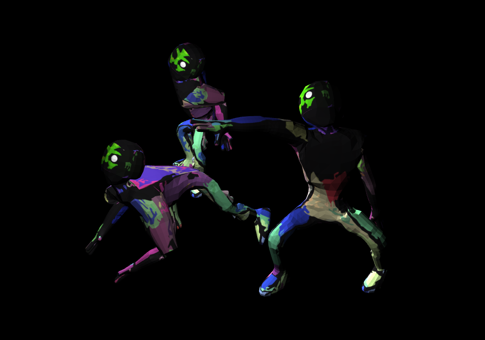
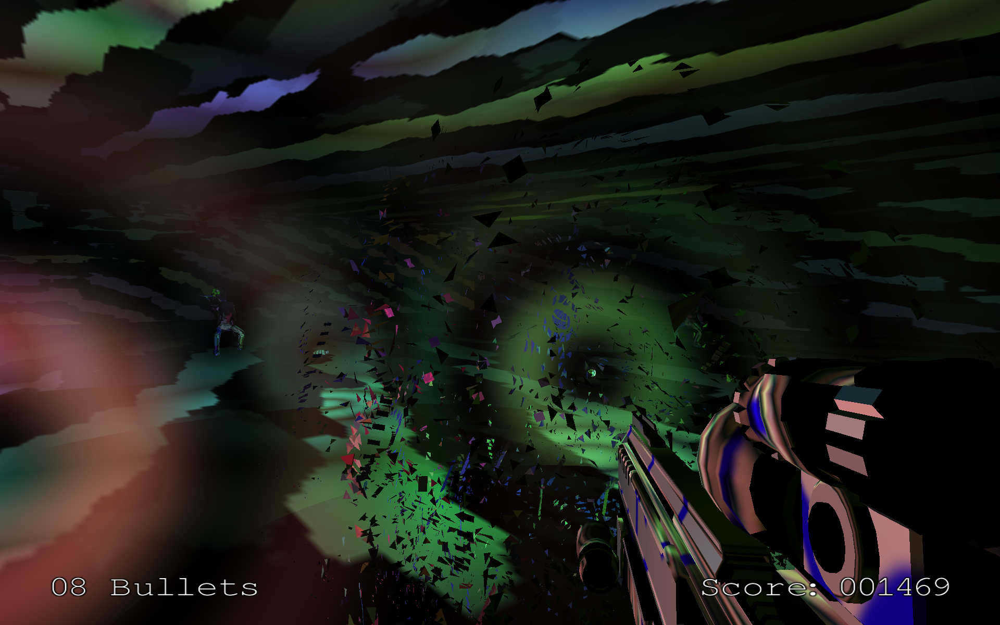
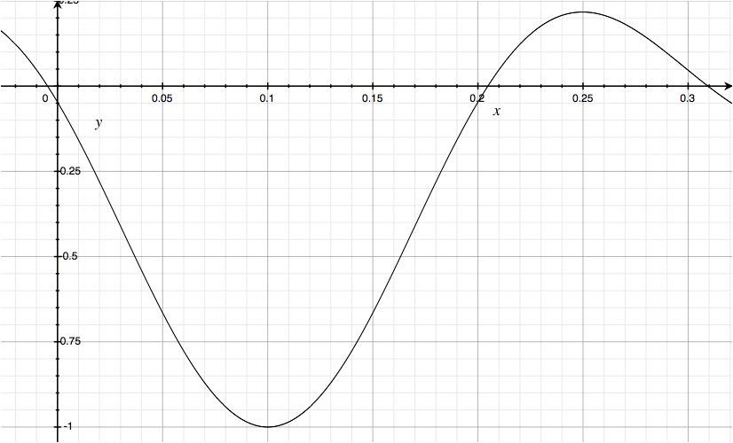

Game Features
--------
### Tweened Animation

I created 3 keyframe meshes for the zombie in blender and saved them into the same
file that gets loaded. Each instantiation of a zombie gets assigned a random
series of the values 0-2, this dictates the order in which it will cycle
through the meshes. Each object starts at the beginning of the series and
interpolates between the first and the second mesh until it becomes the second
mesh, at which point the second becomes the first and the third becomes the
second and it repeats. In order to avoid the zombies moving in unison I assign
each a pseudorandom number with a normal distribution that influences their
speed, so some become faster and some become slower.

### Exploding Zombies
To do this I went to the vertex shader, by using the direction of the normals,
I could project the vertices in that direction using some projectile motion
equations. What initially was planned to be normal projectile motion, I decided
I would make the vertices rise rather than fall to give a sort of ghost effect.
This whole mechanism was controlled by a uniform variable called "EXPLODE",
this variable essentially represented time in the projectile equations, so at
0, the mesh did not explode. After I had this to my liking, I decided to move
back up to the Zombie object and make him thrash and spin when he died. This
would combine with the explosion to give a stormish effect.

### Lighting
The first thing I did with the lighting was distance attenuation, this was a
trivial matter of dividing by the distance between the light source and the
fragment position squared.

In order to do the glow I needed to color fragments that were
in close proximity to the light source from the viewers POV, while I'm sure
I could have achieved this end by mapping the light position through the
perspective matrix and measuring their distance in the projection space and
using z to scale, I did it using distance between the line between the viewer
and the vertex, and the light source. Once I had this and attenuated the glow in
a fashion similar to the general light attenuation I started messing with
brightnesses being a more sinusoidal function of the distance, this resulted in
really cool concentric circles. Then I applied a similar approach to the
brightness on the walls but a sinusoidal function of the distance from the
light and also a dot product of the wall normal and the light to wall vector.
While this was initially meant for the wall it gave some interesting effects
on the gun and zombies.

### Running Bounce and Gun Recoil
The bounce as the player runs is a absolute sine wave as a function of time
from the beginning of the run, stopping when the player comes to a standstill.

Above is the function of the recoil as a function of time from the initial
shot, the gun moves back
and pitches up on the gun shot according to that function.

### Collisions
The collisions are done by describing the Zombies and Player as cylinders and
the bullets as line segments, during each update the bullets position is
logged, then during the following update the previous position and current
position create a line segment in the space and it is tested for intersection
with any of the cylinders. This is done by getting the dot product of the
vector made from
the cylinders center with one side and the vector of the other side with that
side and seeing if it is positive, this is done for the other side. The
closest distance from the center of the cylinder to the line is then checked
to see if it less than the radius of the cylinder. Cylinder intersection is
trivial. Once an intersection occurs each object exhibits "CollisionProperties"
that react with different objects, such as if the property "KILL_ZOMBIE" is
observed by a zombie from an object it has collided with, the zombie will die.

### Controllers and Controlables
A message passing protocol is defined across the program to decouple the
controller inputs from the reactions of those inputs. In the main loop I
assign a controlable to a controller and it sends messages to it dictated
by the enumeration of control signals, these messages then get passed around
and handled by objects which can and should respond to them, this approach
massively reduced the complexity of the controlling of the camera and gun.

### Mesh Loading and Rendering
Each class concerned with loading and rendering a mesh is given a static member
Mesh, this mesh is only loaded on the first instantiation of the class and
shared thereafter. This mean the GPU only has to many one mesh for the many
instantiations of the same object. Each instantiation updates the model matrix
before calling draw on the mesh, creating many versions of the one mesh
efficiently.

### Game Mechanics
The mechanics of the game are that you have a limited number of bullets, and
the bullets are your only source of light. If you miss a zombie, you will lose
the bullet. It is possible to lose all your bullets but you are awarded 20
bullets each wave. The waves get bigger though, so it gets to the point where
you need to retrieve your bullets, removing your only light source in order
to kill the zombies. So you need to balance having light with killing the
zombies. You must survive as long as you can getting a high score. If a zombie
touches you, you will die.

### Followers and Trackables
The zombies can be given an arbitrary trackable that it will follow, if
provided with multiple trackables it will follow the one closest to it. In the
case of this game it is only provided with one, the Player, but given a bullet
or another zombie it would just as happily follow them as they are also
trackable.

### Other Items
All the features below can be found easy and are thoroughly described in the
code
* Audibles and the Audible Space
* Camera Control
* Gun Mechanics
* The Room and Boundaries
* Texturing
* Score Management and the Notification Center
* Text Rendering
* Zombie Wave Management

Install instructions
----------------
### Mac OSX
	./install
	./run

### Libraries:
* [OpenGL Extension Wrangler Library]
* [GLFW]
* [Assimp]
* [DevIL]
* [irrKlang]
* [GLM]

[OpenGL Extension Wrangler Library]:http://glew.sourceforge.net
[GLFW]: http://www.glfw.org
[Assimp]: http://assimp.sourceforge.net
[DevIL]: http://openil.sourceforge.net
[irrKlang]: http://www.ambiera.com/irrklang/
[GLM]: http://glm.g-truc.net/0.9.6/index.html
